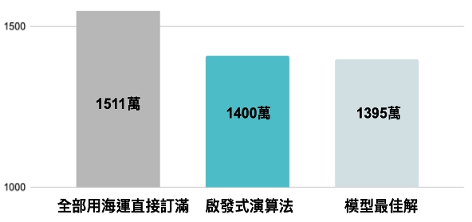

# OR-for-ProcurementStrategy

最佳化訂貨策略實作
+ 使用Gurobi取得最佳解
+ 設計Heuristic演算法逼近最佳解

## 公司簡介
10/10 Apothecary 
客林國際股份有限公司主要經營化妝品、保養品與香氛商品的進口業務，旗下商品種類多樣，於許多知名百貨公司皆有設櫃。
 
 

## 問題描述
+ 結合需求預測模組，打造訂貨決策模組

+ 建立自動化系統最小化公司訂貨成本
由於目前公司的訂貨與存貨控制方式較仰賴於決策者的經驗，若能建立自動化的系統針對訂貨、存貨策略提供建議，便能夠讓決策者在決策時有更明確的資訊來做衡量及判斷。本專案將透過建立模型，協助公司在給定的訂購時點找出最佳訂購量，在缺貨成本與存貨成本之間取得最佳平衡，並維持公司的穩定運作。
 

## 決策目標
+ 目標函數 
  以最小化總成本 - 訂貨成本＋存貨成本（多訂商品所造成的成本）+ 缺貨成本（少訂商品所造成的成本）為目標，來決定本期的訂貨量及訂貨管道。

+ 決策變數 
  決定每期要分別使用快遞／空運／海運訂多少貨。
 

## 公司現行訂貨相關資訊
+ 每個月月初訂貨，未來 1~6 期每期皆可訂貨
+ 每次訂貨時會考慮未來 6 個月的需求，不考慮需求的隨機性。
+ 三種訂貨方式 lead time：快遞 0.5 個月、空運 1.5 個月、海運 2.5 個月。
+ 這個月到的貨下個月開始才能使用。舉例來說，1/1 使用 lead time 為 1.5 個月的空運訂的貨，預期在 2/15 送達，但這批貨從 3 月開始才能被用來銷售，同時也從 3 月開始才會產生存貨成本。
+ 運費分為以商品重量計價的單位成本，及每次使用該運送方式的固定成本。
+ 每月底若存貨＞0，會有存貨成本；反之若存貨＜0，則會有分別有 lost sales 成本和 backorder 成本 。
+ 訂貨時部分商品有 by package 的批量限制。
+ 可訂貨數量的最大值為：第1期期初存貨不能滿足未來六個月所有需求的部分。
 

## 數學模型

### 架構

### Sets & Indices
+  是所有期數的集合
+  是所有商品的集合
+  是所有運輸方式的集合
+  代表整個訂貨計畫中的第 t 期；
+  代表整個訂貨計畫中的第 t 期；
+  代表整個訂貨計畫中的第 t 期；
+  代表快遞， 代表空運， 代表海運
### Decision Variables
+ ：第 t 期商品 i 利用運輸方式 f 訂貨量（單位：package）
+ ：第 t 期商品 i 的「正」期末存貨（單位：package）；
+ ：第 t 期商品 i 的「負」期末存貨（單位：package）；
+ ：第 t 期有利用運輸方式 f 訂購任何產品的二元變數，若有，則；若無，則
### Parameters
+ ：商品 i 在第 t 期可用的在途存貨（單位：package）
+ ：商品 i 在第 0 期的期末存貨（單位：package）
+ ：商品 i 在第 t 期的需求（單位：package）
+ ：商品 i 每 package 的進貨價格
+ ：商品 i 每 package 的存貨成本
+ ：商品 i 每 package 的 backorder 缺貨成本
+ ：商品 i 每 package 的 lost sales 缺貨成本
+ ：商品 i 每 package 利用運輸方式 f 的單位成本
+ ：利用運輸方式 f 的固定成本
+ ：運輸方式 f 的lead time（單位：月）
+ ：商品 i 是否存在運輸方式 f 的二元參數。若有，則；若無，則
+ ：商品 i 的 backorder 比例
### Objective function
&nbsp;&nbsp;&nbsp;+&nbsp;&nbsp;+&nbsp;&nbsp;+&nbsp;&nbsp;+&nbsp;

### Constraints 
+ 期末存貨平衡式：
  + &nbsp;+&nbsp;
&nbsp;+&nbsp;&nbsp;&nbsp;&nbsp;&nbsp;
+ 設定和的初始值：
  + &nbsp;&nbsp;&nbsp;
  + &nbsp;&nbsp;&nbsp;
  + &nbsp;&nbsp;&nbsp;
  + &nbsp;&nbsp;&nbsp;
+ 下面限制式滿足以下三個條件：
  1. 連結&nbsp;&nbsp;和&nbsp;：每個商品只能透過允許的運輸方式訂購
  2. 連結&nbsp;&nbsp;和&nbsp;
  3. 設定&nbsp;&nbsp;的最大值
    + &nbsp;&nbsp;+&nbsp;&nbsp;&nbsp;&nbsp;
+ 是非負整數：
  + +&nbsp;&nbsp;&nbsp;
+ 是二元變數：
  + &nbsp;&nbsp;&nbsp;
 

## 電腦模型：架構與結果

 

## Heuristic Algorithm實作（啟發式演算法）
> 每期需求都要被滿足（第一期除外） 
> 每期只選擇一種到貨運輸方式
 
1. 計算每期當下缺少的商品 package 數 
2. 每期選擇成本最低之運輸方式（考量各商品是否有該運輸方式） 
3. 從最後一期回推，決定是否提前訂貨（考量存貨成本） 
4. 計算訂貨量（考量各商品是否有該運輸方式） 

## 成果
+ 常見的方法與最佳解相差 8.3%
+ 啟發式演算法與最佳解相差 0.35%

