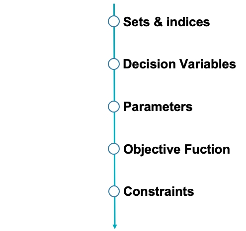

# 10-10_APOTHECARY

Optomaztion of procurement strategy for 10/10 Apothecary

## 公司簡介
客林國際股份有限公司主要經營化妝品、保養品與香氛商品的進口業務，旗下商品種類多樣，於許多知名百貨公司皆有設櫃。

## 問題描述
+ 結合需求預測模組，打造訂貨決策模組

+ 建立自動化系統最小化公司訂貨成本
由於目前公司的訂貨與存貨控制方式較仰賴於決策者的經驗，若能建立自動化的系統針對訂貨、存貨策略提供建議，便能夠讓決策者在決策時有更明確的資訊來做衡量及判斷。本專案將透過建立模型，協助公司在給定的訂購時點找出最佳訂購量，在缺貨成本與存貨成本之間取得最佳平衡，並維持公司的穩定運作。

## 決策目標
+ 目標函數
以最小化總成本 - 訂貨成本＋存貨成本（多訂商品所造成的成本）+ 缺貨成本（少訂商品所造成的成本）為目標，來決定本期的訂貨量及訂貨管道。

+ 決策變數
決定每期要分別使用快遞／空運／海運訂多少貨。

## 公司現行訂貨相關資訊
+ 每個月月初訂貨，未來1~6期每期皆可訂貨
+ 每次訂貨時會考慮未來6個月的需求，不考慮需求的隨機性。
+ 三種訂貨方式lead time：快遞0.5個月、空運1.5個月、海運2.5個月。
+ 這個月到的貨下個月開始才能使用。舉例來說，1/1 使用lead time為1.5個月的空運訂的貨，預期在2/15送達，但這批貨從3月開始才能被用來銷售，同時也從3月開始才會產生存貨成本。
+ 運費分為以商品重量計價的單位成本，及每次使用該運送方式的固定成本。
+ 每月底若存貨＞0，會有存貨成本；反之若存貨＜0，則會有分別有 lost sales成本和backorder成本 。
+ 訂貨時部分商品有by package的批量限制。
+ 可訂貨數量的最大值為：第1期期初存貨不能滿足未來六個月所有需求的部分。

## 數學模型

### 架構

### Sets & Indices
+ T是所有期數的集合
+ I是所有商品的集合
+ F是所有運輸方式的集合
+  代表整個訂貨計畫中的第 t 期；
### Decision Variables

### Parameters

### Objective function

### Constraints 
初始化期初存貨
})

-  
-  
- 

